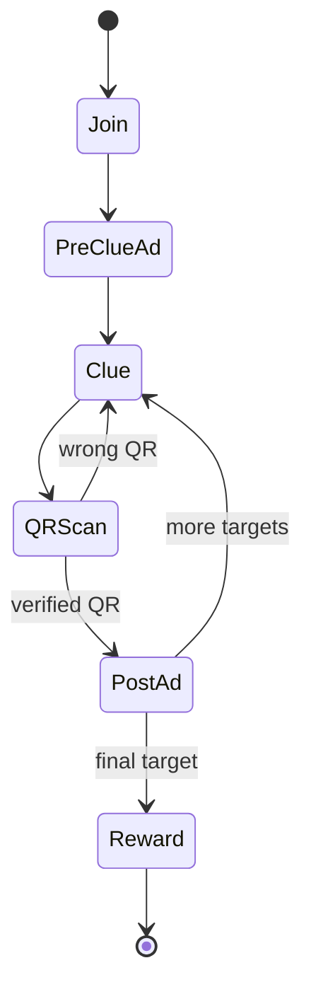
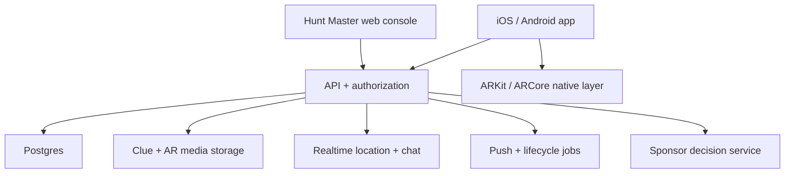

# CLUTRL product blueprint

## Brand

**CLUTRL** ("Clue Trail") is the platform name. Domains owned: CLUTRL.com and
CLUTRL.FUN. Trademark clearance and app-store name availability are not yet
confirmed. Full asset kit lives in `branding logo/CLUTRL_Cross_Platform_Brand_Kit/`
(logos, app icons, colorways, print/social/apparel templates, and the
machine-readable `08_Brand_Standards/brand-tokens.json`, which is the source
of truth below).

- **Tagline (primary):** "The world is your gameboard."
- **Launch line (secondary, used until the pronunciation is familiar):**
  "Follow the clues. Find the experience."
- **Logo:** a split CLU/TRL wordmark plus a standalone symbol — a rounded
  Trail Black square with four Beacon Lime scan-corner brackets and a
  diagonal slash. Implemented in the app as real exported PNGs
  (`assets/brand/symbol-ink-lime.png` / `symbol-lime-ink.png`), not a
  redrawn approximation. Minimum size 24px digital / 9mm print for the
  symbol alone; clear space equal to one scan-corner arm on every side.
- **Domain split:** CLUTRL.com is the organizer/platform/pricing surface;
  CLUTRL.fun is the participant-facing surface (QR entry, live hunts,
  rewards, shareable event links) — this mobile app is the CLUTRL.fun side.
- **Color system** (hex values are canonical, from `brand-tokens.json`):

  | Token | Hex | Role |
  | --- | --- | --- |
  | Trail Black | `#151612` | ink / primary dark |
  | Field Cream | `#F4F0E7` | paper / primary light |
  | Beacon Lime | `#C8FF00` | signature discovery color |
  | Rally Coral | `#FF6048` | live urgency, alerts, competition |
  | Signal Cyan | `#00D7FF` | navigation, location, progress |
  | White | `#FFFFFF` | — |

  Use one bright accent (lime, coral, or cyan) at a time in most layouts.
  There is no violet/purple in the approved palette — the prototype's
  earlier violet accent (Immersive tier, AR, Master role) has been remapped
  to Signal Cyan throughout.
- **Typography (recommended, not yet implemented):** Manrope ExtraBold /
  Inter Black / Montserrat ExtraBold for display type; Inter / Manrope /
  system-ui for UI text. The app currently uses the system font at heavy
  weights (`fontWeight: '900'`) with no custom font loaded — adding the
  real typefaces via `expo-font` is a discrete follow-up, not done in this
  pass, since it touches font-weight styles across every screen and
  deserves its own visual QA.
- Sub-brand system, by hunt format:
  - **CLUTRL Pista** — checkpoint and location-based clue trails
  - **CLUTRL Haystack** — object-finding and photo challenges
  - **CLUTRL Hare & Hounds** — live team pursuit
  - **CLUTRL Quest** — story-driven adventures
  - **CLUTRL AR** — augmented-reality hunts
  - **CLUTRL Live** — festivals, conferences, and community events

None of these sub-brands have scoped features yet — the current prototype
maps to what would be a CLUTRL Pista + CLUTRL AR hybrid experience.

## 1. Product definition

CLUTRL is a mobile platform for camera-first scavenger hunts. A Hunt Master
creates a hunt with at least 10 discoveries, assigns each discovery a printed QR
marker, publishes multimedia clues, follows eligible teams, answers requests for
help, and releases a reward when the route is complete.

The product has two users:

- **Hunter:** joins with a code or invite, sees sponsor-supported clues, verifies
  discoveries with the camera, and earns the configured reward.
- **Hunt Master:** creates and operates hunts, prints target codes, watches team
  status on eligible plans, responds to clue questions, and reviews results.

The mobile app should serve both roles. A responsive web console should be added
for hunt authoring, bulk media upload, QR printing, sponsor management, and
event-day operations.

## 2. Access tiers

| Capability | Base | Live | Immersive |
| --- | ---: | ---: | ---: |
| Minimum 10 targets | Yes | Yes | Yes |
| Text, photo, and video clues | Yes | Yes | Yes |
| Camera QR verification | Yes | Yes | Yes |
| Pre-clue sponsor placement (once, before the first clue) | Yes | Yes | Yes |
| Post-find sponsor placement | Yes | Yes | Yes |
| Completion image and reward | Yes | Yes | Yes |
| Participant live location | — | Yes | Yes |
| Hunt Master clue-help chat | — | Yes | Yes |
| Geolocated AR objects | — | — | Yes |
| AR photo capture | — | — | Yes |

The organizer purchases or selects the hunt tier. Participants inherit the
features of that hunt; they should not individually pay to unlock location or AR
after joining.

## 3. Core state sequence



Business rules:

1. A published hunt must contain at least 10 active items.
2. Only the QR assigned to the current item advances that hunter.
3. Progress writes must be idempotent; repeated scans cannot create duplicate
   completions or rewards.
4. The server, not the app, is the authority for order, completion, reward
   eligibility, tier access, and QR validity.
5. A reward redemption must be single-use unless the organizer explicitly
   configures otherwise.
6. Location sharing begins only after consent and only while an eligible hunt
   session is active.
7. Each hunter is assigned their own randomized visiting order over a hunt's
   targets at join time, not the shared authoring order — so hunters can't
   just tail whoever finds the next target first. Every hunter still finds
   every target; only the order differs per hunter.

## 4. Experience design

### Hunter journey

1. Download or open the app from an event invite.
2. Create a lightweight account or continue with an event guest identity.
3. Enter a hunt code, open a deep link, or scan an event-start QR.
4. Review safety, location, camera, and sponsor disclosures.
5. See the pre-clue sponsor placement.
6. Receive the text, photo, video, or AR clue.
7. Find the physical target and scan its code.
8. See one post-find sponsor placement.
9. Repeat until all items are complete.
10. Receive the congratulations visual and configured reward.

### Hunt Master journey

1. Create the hunt, choose its tier, time window, route boundary, and safety
   contact.
2. Add at least 10 discoveries and order them.
3. Upload clue media, write alternate text/captions, set optional hints, and
   locate AR items.
4. Generate target QR codes, print the pack, and perform a field test.
5. Configure sponsor inventory and the completion reward.
6. Publish, distribute the join code, and open the event.
7. Watch participant status, respond to help requests, and pause or close the
   hunt if needed.
8. Review completion, drop-off, clue difficulty, sponsor delivery, and reward
   redemption.

## 5. Recommended system architecture



Recommended MVP stack:

- **Mobile:** Expo/React Native, TypeScript, development builds for native SDKs.
- **Web console:** Next.js with the same design tokens and shared API types.
- **Backend:** Supabase initially for Postgres, Auth, Storage, Realtime, and Edge
  Functions. This reduces time-to-market while preserving a standard Postgres
  data model.
- **Push:** Expo Push Notifications for MVP; move to direct APNs/FCM only if
  scale or delivery requirements justify it.
- **Media:** private object storage with signed, short-lived delivery URLs.
- **Observability:** Sentry plus structured product events and audit logs.
- **Maps:** native maps for Hunt Master operations, with geofence and route
  overlays.
- **AR:** a custom native module for ARKit and ARCore, or Unity AR Foundation if
  the content roadmap becomes 3D-heavy.

### Realtime location

The Live and Immersive tiers should send event-scoped pings rather than a
continuous permanent trail:

- foreground update every 5–10 seconds or 10–20 meters;
- reduce frequency when stationary or battery is low;
- use a short server TTL for raw pings;
- expose a coarse/precise choice if the hunt format permits;
- stop automatically on completion, withdrawal, hunt close, or permission loss;
- show a persistent in-app “sharing” state and a one-tap stop control.

If the business later requires background location, treat it as a separate
release with an explicit review of necessity, permissions, disclosures, battery
impact, and app-store requirements.

### QR verification

Demo codes use readable deep links. Production codes should contain a random
target token such as:

```text
clutrl://v1/t/8TgWqYxM3N4kP2...
```

The API stores only a keyed hash, verifies the token against the participant’s
current hunt item, applies time and status constraints, records an idempotent
completion, and returns the next allowed state. Optional anti-sharing controls:

- rotating or time-boxed target tokens;
- device attestation;
- a loose proximity check for Live/Immersive hunts;
- scan-rate anomaly detection;
- printable fallback codes held by the Hunt Master.

Do not make precise GPS a hard requirement for Base hunts; QR should remain the
primary physical proof.

## 6. Advertising design and policy risk

The prototype implements a lighter cadence:

- one placement, shown once, before the first clue;
- one placement after every confirmed find.

Repeated programmatic interstitials can still create poor experiences and
policy risk even at this lower frequency. The recommended business model is:

1. sell direct, event-specific **sponsor cards** that are part of the hunt’s
   presentation;
2. make every card clearly labeled and independently dismissible after its
   contracted view time;
3. never place a deceptive close control near the scan/continue target;
4. cap programmatic interstitial frequency if an ad network is added;
5. A/B test completion rate, time between discoveries, quit rate, and sponsor
   recall;
6. offer organizers a sponsored-hunt package and an ad-free private-event
   package.

For a first launch, direct sponsor inventory is more controllable than AdMob and
better aligned with local events, restaurants, tourism bureaus, venues, and
brand activations.

Recommended events:

| Event | Key properties |
| --- | --- |
| `hunt_joined` | hunt, tier, join source |
| `ad_impression` | placement, sponsor, moment, clue |
| `ad_dismissed` | placement, visible milliseconds |
| `clue_viewed` | clue, media type, attempt |
| `hint_revealed` | clue, elapsed time |
| `qr_scan_failed` | clue, reason |
| `item_completed` | clue, elapsed time, scan count |
| `help_requested` | clue, category |
| `location_opted_in` | permission level |
| `ar_localized` | anchor, accuracy, latency |
| `ar_capture_created` | asset, clue |
| `hunt_completed` | duration, items, hints |
| `reward_redeemed` | reward, venue |

## 7. True geolocated AR

The Expo camera overlay in this prototype validates the interaction design. A
production AR object must remain stable in the physical world as the hunter
moves.

Recommended approach:

- **iOS:** ARKit geo-tracking with `ARGeoAnchor` where coverage is available.
- **Android:** ARCore Geospatial API with Visual Positioning System localization
  and WGS84, Terrain, or Rooftop anchors.
- Gate the experience on location accuracy, heading accuracy, AR support, VPS
  availability, daylight/visual conditions, and distance to target.
- Offer a 2D camera overlay or normal QR clue when localization is unavailable.
- Store asset version, scale, orientation, altitude mode, activation radius,
  fallback instructions, and platform compatibility per AR item.
- Composite the rendered AR frame into the captured image before saving or
  sharing; do not rely on a screenshot of the preview.

Unity AR Foundation is the better choice if the roadmap includes rich 3D games,
physics, character interaction, or a large asset team. Native ARKit/ARCore
bridges are leaner for lightweight location-locked animations and a
camera-forward React Native product.

## 8. Safety, privacy, and moderation

Before launch:

- minimum-age policy and guardian flow for youth events;
- route review for traffic, private property, accessibility, restricted areas,
  and night safety;
- Hunt Master emergency pause and broadcast;
- report/block tools for chat;
- automated media scanning plus organizer review for uploaded clues;
- exact data retention table for location, chat, photos, and analytics;
- delete-account and export-data workflows;
- privacy policy, terms, event organizer agreement, reward terms, and sponsor
  disclosures;
- App Store and Play data-safety disclosures covering every third-party SDK;
- no sale or ad-targeting use of precise hunter location.

Default retention recommendation:

| Data | Default |
| --- | --- |
| Raw location pings | Delete within 24 hours after hunt close |
| Aggregated route analytics | De-identify, then retain per contract |
| Help chat | 30 days |
| AR captures | On device unless the hunter explicitly uploads |
| QR verification/audit | 90 days |
| Reward redemption | Contract/accounting period |

This is a product recommendation, not legal advice; counsel should review the
actual markets, age groups, sponsors, and data flows before release.

## 9. Delivery roadmap

### Phase 0 — Validation (2–3 weeks)

- 5–8 organizer interviews across events, tourism, corporate team-building,
  schools, and brand activations
- field-test the requested ad cadence
- choose the first customer segment
- trademark/domain/app-store name clearance
- define reward liability and organizer terms

### Phase 1 — Base beta (6–8 weeks)

- authentication and guest join
- Hunt Master web authoring
- 10+ ordered multimedia items
- secure QR generation and verification
- direct sponsor placements
- rewards and redemption
- event analytics
- TestFlight and Play closed test

### Phase 2 — Live beta (4–6 weeks)

- explicit location consent and event-time sharing
- realtime Hunt Master map
- clue-help messaging and notifications
- pause, broadcast, moderation, and location retention jobs
- field and battery testing

### Phase 3 — Immersive pilot (6–10 weeks)

- ARKit/ARCore geospatial native layer
- AR asset pipeline and device capability checks
- AR photo compositing and sharing
- fallback experiences
- accuracy testing at every launch venue

### Phase 4 — Commercial launch

- billing, team roles, sponsor operations, templates, audit logs, support tools,
  abuse controls, accessibility audit, store review, and launch analytics

A practical first team is one senior React Native engineer, one
backend/full-stack engineer, a product designer, and part-time QA/content
operations. Native AR expertise becomes necessary in Phase 3.

## 10. Decisions needed before production

1. Primary buyer: event organizer, tourism organization, venue, brand, school,
   or consumers?
2. Public marketplace of hunts or private invite-only events first?
3. Direct sponsor sales only, or programmatic ads too?
4. ~~Must hunt order be fixed, flexible, team-synchronized, or configurable?~~
   Decided: per-hunter randomized (business rule 7, section 3) — not
   configurable yet.
5. Are rewards issued by the platform or entirely by organizers?
6. Are minors allowed?
7. Is background location genuinely required?
8. Does the first AR launch need 3D characters, or are animated 2D/particle
   objects enough?
9. ~~What is the final product name and visual brand?~~ Decided: CLUTRL — see
   the Brand section above. Full trademark clearance still outstanding.

## 11. Current prototype acceptance checklist

- [x] Seeded hunt contains 10 items
- [x] Text, photo, video, and AR clue treatments
- [x] One pre-clue sponsor state before the first clue and one post-find sponsor state per discovery
- [x] Camera QR scanning and exact-current-target validation
- [x] Congratulations and reward state
- [x] Base, Live, and Immersive feature gates
- [x] Foreground GPS proof of concept
- [x] Hunt Master team map and help indicators
- [x] Local clue-help conversation
- [x] Camera AR overlay and capture preview
- [x] Printable QR sheet
- [x] Unit-tested progression rules
- [x] Supabase auth (guest sign-in for hunters, email magic link for Hunt
      Masters) with a self-service `profiles` row on first sign-in
- [x] Hunt join, clue delivery, and QR verification wired to Supabase
      (`join_hunt`, `my_current_items`, `submit_scan`) when signed in;
      falls back to local demo state otherwise
- [x] Server-authoritative QR verification (hashed server-side, never
      exposed to the client, in remote mode)
- [ ] Realtime production location and chat
- [ ] Sponsor/ad decision service
- [ ] Push notifications
- [ ] Native geospatial AR
- [ ] Hunt Master authoring web console
- [ ] App-store privacy and production release work

## 12. Reference links

- Expo Camera: <https://docs.expo.dev/versions/latest/sdk/camera/>
- Expo Location: <https://docs.expo.dev/versions/latest/sdk/location/>
- Apple `ARGeoAnchor`: <https://developer.apple.com/documentation/arkit/argeoanchor>
- ARCore Geospatial API: <https://developers.google.com/ar/develop/geospatial>
- Apple App Privacy Details: <https://developer.apple.com/app-store/app-privacy-details/>
- Google interstitial guidance:
  <https://support.google.com/admob/answer/6201362?hl=en>
